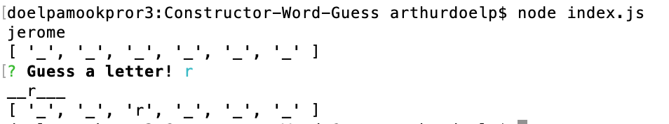

# Constructor-Word-Guess

# Overview

For this app I created a word-guess (hangman) game where the computer generates a random word from an array and replaces the letters with underscores.  I then use the inquire prompt package to ask the user to guess a letter.  If the letter matches a letter in the random word, then the CLI spawns a string with the respective underscore replaced with the letter that was guessed.

Given the time, this was the farthest I could get on this.  I still have yet to develop the game theory by creating a winning and losing component.  Also I got stuck on recursion associated with the inquire prompt and properly populating an array of matching letters after the first try.  I was able to ask the user and replace the values once, but I could not get the prompt to ask again and thus fill in more letters.

